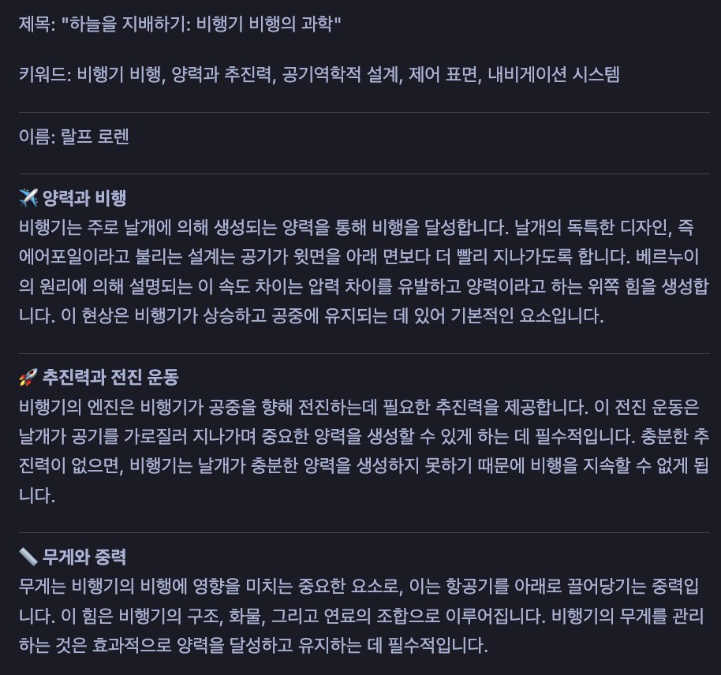

# GAI4003 오픈소스SW응용
## 6주차 과제
**학번:** 2022106099 **이름:** 남레베까 (Rebeca Nam)

---

## 1. 개요

본 보고서는 [`deepagents`](https://github.com/langchain-ai/deepagents) 파이썬 라이브러리를 활용하여 다단계 논리적 추론이 필요한 콘텐츠 생성 에이전트 팀을 구현한 실습 과정을 정리한 것입니다.

`deepagents`는 LangChain과 LangGraph 기반의 에이전트 하네스(agent harness)로, 계획(planning), 파일시스템, 셸 접근, 서브에이전트 위임 등의 기능을 기본으로 제공합니다. 본 실습에서는 `create_deep_agent`를 활용하여 **리서치 → 글쓰기 → 제목 생성 → 번역 → 저장**의 5단계 파이프라인을 구현하였습니다.

**에이전트 목표:** 주어진 주제에 대해 자동으로 조사하고, 형식에 맞는 영문 기사를 작성한 뒤, SEO 제목과 키워드를 생성하고, 한국어로 번역하여 두 개의 파일로 저장한다.

---

## 2. 에이전트 구조 및 동작 원리

```
사용자 프롬프트
      ↓
🔍 research_agent    → 주제를 조사하여 핵심 내용을 bullet point로 정리
      ↓
✍️  writer_agent     → 조사 내용을 바탕으로 영문 기사 작성
      ↓
🏷️  title_agent      → 기사를 바탕으로 SEO 제목 및 키워드 생성
      ↓
🌏 translator_agent  → 영문 기사 + 제목/키워드를 한국어로 번역
      ↓
💾 save_output (tool) → 영문 및 한국어 .md 파일로 저장
      ↓
최종 결과 출력
```

| 구분 | 이름 | 역할 |
|---|---|---|
| 서브에이전트 | `research_agent` | 주제를 분석하고 구조화된 사실 정보를 bullet point로 반환 |
| 서브에이전트 | `writer_agent` | 조사 내용을 바탕으로 영문 기사 작성 |
| 서브에이전트 | `title_agent` | 기사에 맞는 SEO 제목과 키워드 5개 생성 |
| 서브에이전트 | `translator_agent` | 영문 기사 + 제목/키워드를 한국어로 번역 |
| 툴 | `save_output` | 영문 및 번역본을 타임스탬프가 포함된 `.md` 파일로 저장 |

---

## 3. 실습 과정

### 3.1 첫 번째 시도 — 서브에이전트 2개 (리서처 + 작가)

처음에는 `research_agent`와 `writer_agent` 두 개의 서브에이전트만으로 파이프라인을 구성하였습니다.

```python
main_agent = create_deep_agent(
    model=model,
    tools=[call_research_agent, call_writer_agent],
    system_prompt="You are a supervisor. Call research first, then writer."
)
```

리서처가 조사한 내용을 작가에게 전달하여 기사를 생성하는 기본 흐름은 정상적으로 작동하였습니다.

---

### 3.2 두 번째 시도 — 출력 형식 지정 (`Name` 첫 줄 + 이모지 소제목)

기사의 첫 줄을 항상 `Name: Raulph Lauren`으로 고정하고, 각 문단에 이모지 소제목을 추가하기 위해 먼저 `writer_agent`의 system prompt에 해당 지시를 추가하였습니다.

```python
writer_agent = create_deep_agent(
    model=model,
    system_prompt="""You are a content writer.
    1. The VERY FIRST LINE must be exactly: 'Name: Raulph Lauren'
    2. Every paragraph must have a subtitle with a corresponding emoji"""
)
```

그러나 실행 결과, `writer_agent`는 올바르게 형식을 따랐지만 **오케스트레이터(`main_agent`)가 최종 출력을 자체적으로 재구성**하면서 첫 줄 형식과 이모지 소제목이 모두 사라지는 문제가 발생하였습니다.

이는 서브에이전트의 출력이 오케스트레이터를 거쳐 최종 응답으로 재작성되기 때문임을 깨달았습니다. 따라서 형식 지시는 서브에이전트가 아닌 **오케스트레이터의 system prompt에 명시**해야 한다는 것을 확인하였습니다.

```python
main_agent = create_deep_agent(
    model=model,
    tools=[...],
    system_prompt="""...
    Formatting rules:
    - First line must always be 'Name: Raulph Lauren'
    - Every paragraph needs a subtitle with an emoji
    - Do NOT rewrite or summarize the writer's response."""
)
```

이후 형식이 올바르게 유지되었습니다.

---

### 3.3 세 번째 시도 — 파일 저장 툴 추가

기사를 자동으로 저장하기 위해 `save_output` 툴을 추가하였습니다.

```python
@tool("save_output", description="Save the English article and Korean translation to files.")
def save_output(article: str, translation: str, title_and_keywords: str) -> str:
    from datetime import datetime
    timestamp = datetime.now().strftime("%Y%m%d_%H%M%S")
    article_path = f"output_{timestamp}_en.md"
    translation_path = f"output_{timestamp}_ko.md"

    full_content = f"{title_and_keywords}\n\n---\n\n{article}"

    with open(article_path, "w") as f:
        f.write(full_content)
    with open(translation_path, "w", encoding="utf-8") as f:
        f.write(translation)

    return f"✅ Saved:\n  English → {article_path}\n  Korean  → {translation_path}"
```

---

### 3.4 네 번째 시도 — 제목 생성 서브에이전트 추가

SEO 제목과 키워드를 자동으로 생성하기 위해 `title_agent`를 추가하였습니다.

```python
title_agent = create_deep_agent(
    model=model,
    system_prompt="""You are an SEO title specialist. When given an article:
    1. Generate a catchy, engaging title for the article
    2. Generate 5 relevant SEO keywords
    3. Return ONLY in this exact format:

    TITLE: [your title here]
    KEYWORDS: keyword1, keyword2, keyword3, keyword4, keyword5"""
)
```

---

### 3.5 다섯 번째 시도 — 번역 서브에이전트 추가 (최종 버전)

마지막으로 `translator_agent`를 추가하여 영문 기사와 제목/키워드를 함께 한국어로 번역하도록 구현하였습니다. 처음에는 기사만 번역에 전달했으나, 제목과 키워드가 한국어 버전에서 누락되는 문제가 발생하였습니다. 이를 해결하기 위해 제목/키워드와 기사를 합쳐서 번역 에이전트에 전달하도록 수정하였습니다.

```python
@tool("translator", description="Translate the finished article AND title/keywords into Korean.")
def call_translator_agent(article: str, title_and_keywords: str) -> str:
    combined = f"{title_and_keywords}\n\n---\n\n{article}"
    result = translator_agent.invoke({
        "messages": [{"role": "user", "content": combined}]
    })
    return result["messages"][-1].content
```
---

## 4. 실행 결과

실행 후 두 개의 파일이 생성됩니다:

```
✅ Saved:
  English → output_20260409_143022_en.md
  Korean  → output_20260409_143022_ko.md
```



예시 출력 파일은 [`examples/`](./examples/) 폴더에서 확인할 수 있습니다.

---

## 5. 결론

본 실습을 통해 `deepagents` 라이브러리를 활용한 다단계 에이전트 파이프라인 구현 방법을 학습하였습니다.

실습 과정에서 발견한 주요 사항은 다음과 같습니다:

- **서브에이전트의 system prompt만으로는 최종 출력 형식을 보장할 수 없다.** 오케스트레이터가 서브에이전트의 결과를 받아 자체적으로 재구성하기 때문에, 형식 관련 지시는 반드시 오케스트레이터의 system prompt에도 명시해야 한다.
- **서브에이전트 간 데이터 전달을 명확히 설계해야 한다.** 번역 에이전트에 기사만 전달했을 때 제목/키워드가 누락된 사례처럼, 각 에이전트가 받는 입력을 정확히 정의하는 것이 중요하다.

---

## 6. 참고

- [deepagents GitHub](https://github.com/langchain-ai/deepagents)
- [LangChain Docs](https://docs.langchain.com)